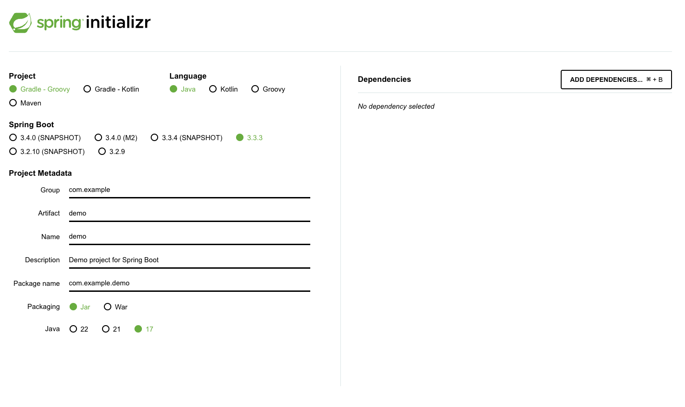

## Spring Framework

이 repository는 스프링을 입문하면서 다룬 내용을 담고 있습니다.  
아주 기본적인 내용인 스프링 MVC 부터 AOP까지 처음 접할 때 알아야 할 기본적인 내용들을 공부하였습니다.

## Spring 환경 세팅하기
스프링을 처음 시작할 때 환경 세팅이 가장 중요합니다. `intellij`나 `eclipse`를 통해서도 스프링 프로젝트를 생성할 수 있지만  
이 README에서는 `spring.io` 를 통해서 생성해 보도록 하겠습니다.

우선 다음 링크를 통해서 `spring.io`에 들어가 줍니다.  
<a href="https://start.spring.io/">spring initializr</a>

링크로 들어가면 위 사진과 같은 화면을 확인할 수 있습니다. 이것은 스프링 부트 기반으로 스프링 관련된 프로젝트를 만들어주는 사이트입니다.  
이제 하니씩 살펴보자면 Project를 살펴보면 Maven과 Gradle을 확인할 수 있습니다.

**그래서 Maven & Gradle이 뭐냐?**
> Maven과 Gradle은 모두 빌드 관리 도구입니다.  
여기서 빌드 관리 도구란 소스코드에서 애플리케이션을 생성하면서 여러가지 외부 라이브러리를 사용하는 데,  
빌드 관리 도구는 사용자가 관리할 필요 없이 필요한 라이브러리들을 자동으로 관리합니다.

과거에는 Maven을 많이 사용했지만 요즘은 Gradle로 넘어가는 추세입니다. 물론 레거시 프로젝트나 과거 프로젝트는 Maven으로 아직 남아 있습니다.  
Spring Boot 버전은 `()` 괄호 안에 있는 글자 말고 순수하게 버전만 적혀져 있는 것을 선택하는 것이 안정적입니다.

그 다음에 프로젝트 메타는 프로젝트의 구조를 정해줍니다. 자신만의 프로젝트라면 자신만의 프로젝트 관리 하는 방법을 통해 작성해주세요.  
이제 Dependencies를 통해서 의존성을 추가해주면 `GENERATE`를 통해 스프링 프로젝트를 생성할 수 있습니다.